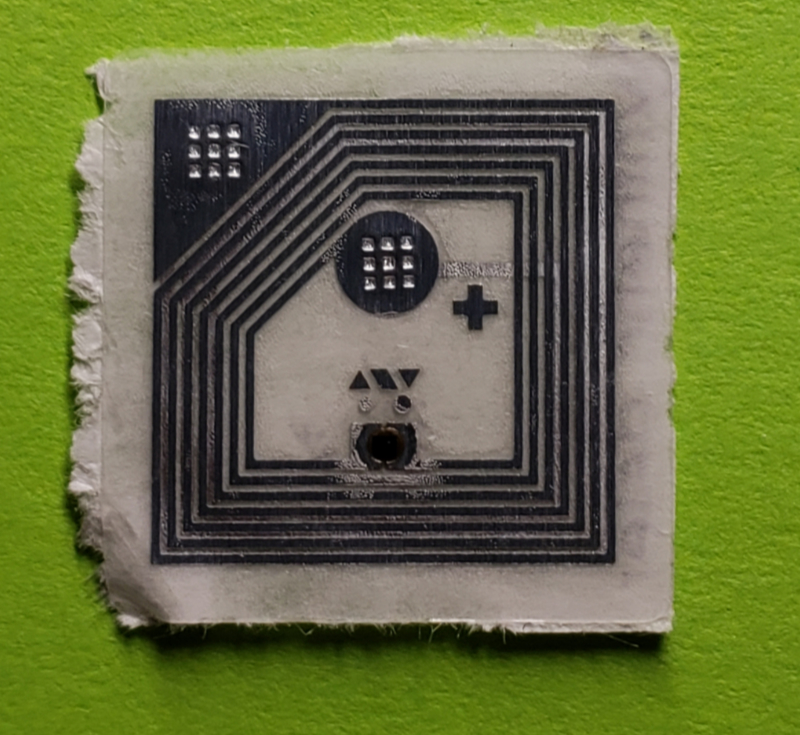
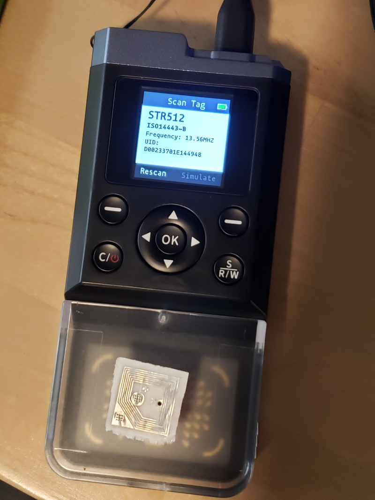
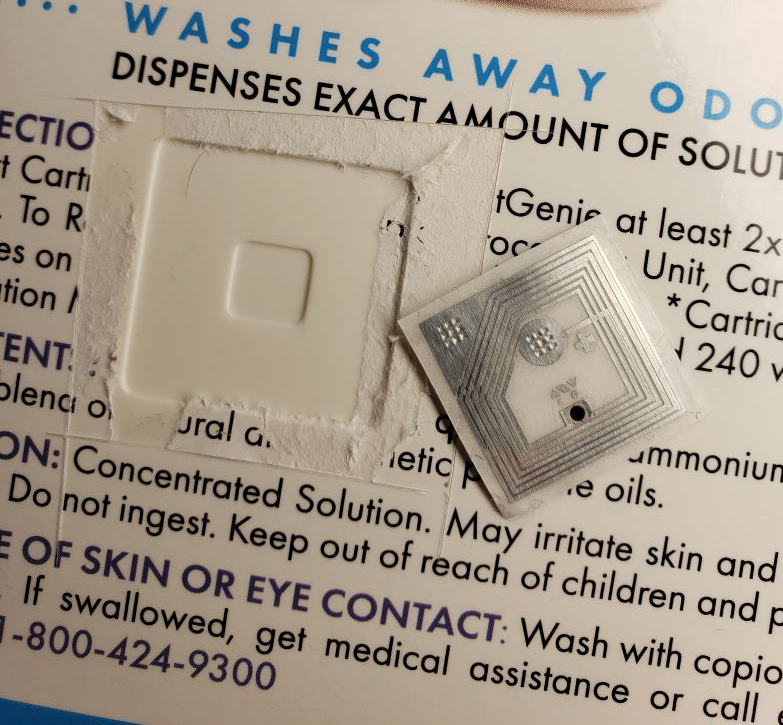
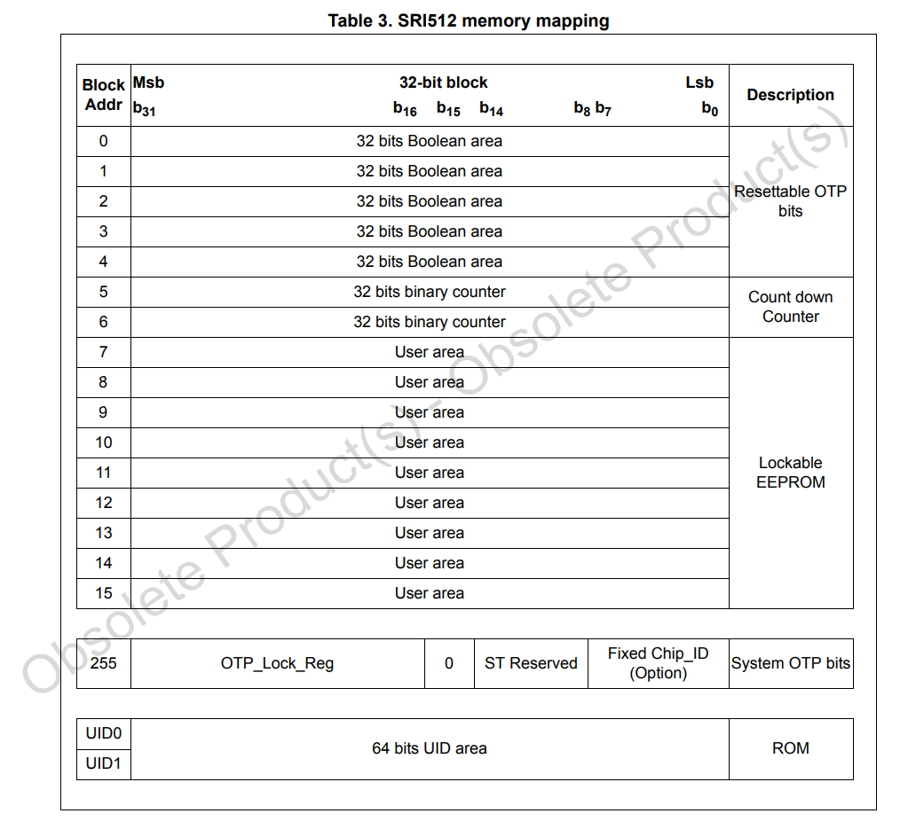

# cats-hate-drm

This is just info I have gathered. If you are able to make any further descoveries please consider submitting it to this repo.

## Tag Info

The CatGenie AI uses solution for the older 120 model. Here's the [Datasheet](https://www.st.com/en/nfc/sri512.html) for the SRT/SRI512 chip that is installed in the label of the washing solution.





Address 5, 6 are the wash counters. The examples are from the 120/240 cycle containers (0x78 = 120). I am assuming that for the heavy wash it decrements both counters and the light wash only one counter is decremented in an alternating fashion. 



### Example New Tag Outputs

```
[+]  UID: D0 02 33 70 1E 14 49 48
[+]  MFG: 02, ST Microelectronics SA France
[+] Chip: 0C, SRT512

[#] Address=00, Contents=00000000, CRC=defc
[#] Address=01, Contents=ffffffff, CRC=470f
[#] Address=02, Contents=ffffffff, CRC=470f
[#] Address=03, Contents=ffffffff, CRC=470f
[#] Address=04, Contents=ffffffff, CRC=470f
[#] Address=05, Contents=00000078, CRC=4343
[#] Address=06, Contents=00000078, CRC=4343
[#] Address=07, Contents=00000e16, CRC=fe64
[#] Address=08, Contents=00780001, CRC=61de
[#] Address=09, Contents=00780001, CRC=61de
[#] Address=0a, Contents=00780001, CRC=61de
[#] Address=0b, Contents=00000f04, CRC=f5c4
[#] Address=0c, Contents=00000f04, CRC=f5c4
[#] Address=0d, Contents=7349c58e, CRC=b79c
[#] Address=0e, Contents=7349c58e, CRC=b79c
[#] Address=0f, Contents=fa1a0f04, CRC=c1f4
[#] Address=ff, Contents=ffffffff, CRC=470f
```

```
[+]  UID: D0 02 33 70 1F 8E CC 74
[+]  MFG: 02, ST Microelectronics SA France
[+] Chip: 0C, SRT512

[#] Address=00, Contents=00000000, CRC=defc
[#] Address=01, Contents=ffffffff, CRC=470f
[#] Address=02, Contents=ffffffff, CRC=470f
[#] Address=03, Contents=ffffffff, CRC=470f
[#] Address=04, Contents=ffffffff, CRC=470f
[#] Address=05, Contents=00000078, CRC=4343
[#] Address=06, Contents=00000078, CRC=4343
[#] Address=07, Contents=00003015, CRC=86d7
[#] Address=08, Contents=00780001, CRC=61de
[#] Address=09, Contents=00780001, CRC=61de
[#] Address=0a, Contents=00780001, CRC=61de
[#] Address=0b, Contents=00000f04, CRC=f5c4
[#] Address=0c, Contents=00000f04, CRC=f5c4
[#] Address=0d, Contents=4e32014e, CRC=9f30
[#] Address=0e, Contents=4e32014e, CRC=9f30
[#] Address=0f, Contents=fc790f04, CRC=cade
[#] Address=ff, Contents=ffffffff, CRC=470f
```

```
[+]  UID: D0 02 33 70 1F 85 13 D8
[+]  MFG: 02, ST Microelectronics SA France
[+] Chip: 0C, SRT512

[#] Address=00, Contents=00000000, CRC=defc
[#] Address=01, Contents=ffffffff, CRC=470f
[#] Address=02, Contents=ffffffff, CRC=470f
[#] Address=03, Contents=ffffffff, CRC=470f
[#] Address=04, Contents=ffffffff, CRC=470f
[#] Address=05, Contents=00000078, CRC=4343
[#] Address=06, Contents=00000078, CRC=4343
[#] Address=07, Contents=00003015, CRC=86d7
[#] Address=08, Contents=00780001, CRC=61de
[#] Address=09, Contents=00780001, CRC=61de
[#] Address=0a, Contents=00780001, CRC=61de
[#] Address=0b, Contents=00000f04, CRC=f5c4
[#] Address=0c, Contents=00000f04, CRC=f5c4
[#] Address=0d, Contents=45795d45, CRC=d7ca
[#] Address=0e, Contents=45795d45, CRC=d7ca
[#] Address=0f, Contents=fb570f04, CRC=5613
[#] Address=ff, Contents=ffffffff, CRC=470f
```

### (TBD) Used Tag Outputs